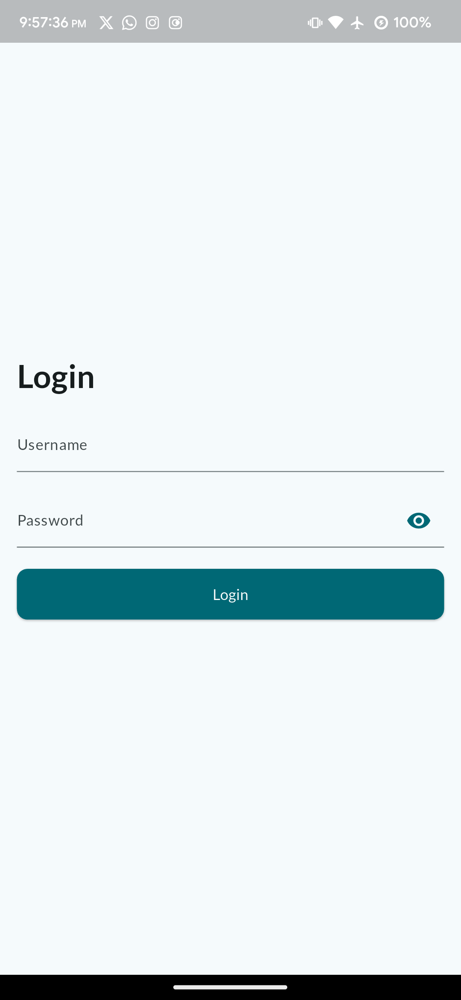
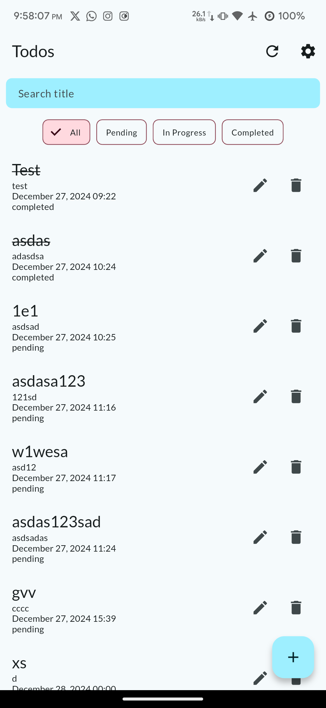
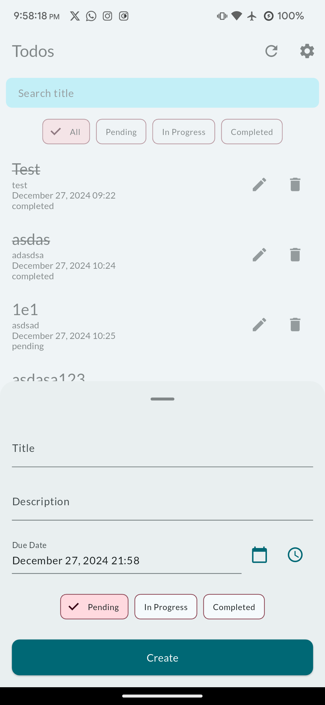
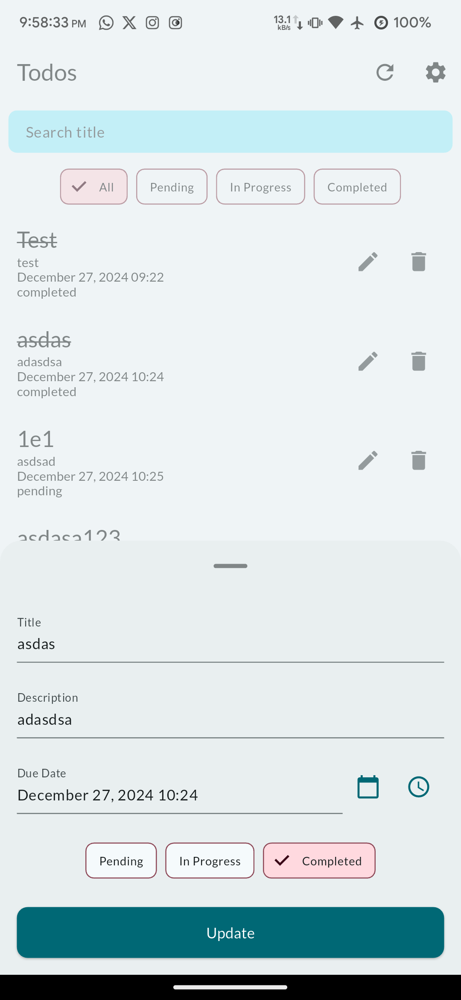

# tes_venteny

A Flutter project designed as a starting point for application development, following best practices and structured architecture.

| Login Screen | Home Screen | Add Item Screen | Update Item Screen |
|------------|------------|------------|-------------|
|  |  |  |  |

## Table of Contents

- [tes\_venteny](#tes_venteny)
  - [Table of Contents](#table-of-contents)
  - [Getting Started](#getting-started)
  - [Project Structure](#project-structure)
  - [Dependencies](#dependencies)
  - [Assets](#assets)
  - [Localization](#localization)
  - [Contributing](#contributing)

## Getting Started

To get started with this project:

1. **Clone the repository**:

   ```bash
   git clone https://github.com/rfaturriza/tes_venteny.git
   cd tes_venteny
   ```

2. **Install dependencies**:

   Ensure you have [Flutter](https://flutter.dev/docs/get-started/install) installed. Then, run:

   ```bash
   flutter pub get
   dart run build_runner build --delete-conflicting-outputs
   ```
   If you are using FVM. Then, run:

   ```bash
   fvm install
   fvm flutter pub get
   fvm dart run build_runner build --delete-conflicting-outputs
   ```

3. **Run the application**:

   ```bash
   flutter run
   ```

For detailed guidance on Flutter development, refer to the [official documentation](https://docs.flutter.dev/).

## Project Structure

The project follows a feature-based structure:

- **lib/**: Contains the main source code.
    - **features/**: Encapsulates different modules or features of the app.
        - **auth/**: Handles authentication-related functionality.
            - **data/**: Manages data sources and models.
            - **domain/**: Contains business logic and entities.
            - **presentation/**: Manages UI components and state.
    - **core/**: Includes shared resources like utilities, constants, and themes.
    - **main.dart**: Entry point of the application.

This structure promotes modularity and scalability, adhering to clean architecture principles.

## Dependencies

The project utilizes several packages to enhance development:

- **flutter_bloc**: For state management.
- **equatable**: To simplify value comparisons.
- **connectivity_plus**, **dart_ping**: To monitor network connectivity.
- **freezed**: For immutable data classes and union types.
- **json_serializable**: To handle JSON serialization.
- **get_it**, **injectable**: For dependency injection.
- **shared_preferences**, **sqflite**: For local data storage.
- **dio**: For making HTTP requests.
- **flutter_local_notifications**: To display local notifications.

For the complete list, refer to the `pubspec.yaml` file.

## Assets

The `assets` directory houses images, fonts, and other files included in the application.

- **assets/images/**: Contains resolution-aware images.

Ensure that any new assets are declared in the `pubspec.yaml` file under the `assets` section.

## Localization

This project supports multiple languages and generates localized messages based on ARB files located in the `lib/src/localization` directory.

To add support for additional languages, follow the [Internationalizing Flutter apps](https://docs.flutter.dev/development/accessibility-and-localization/internationalization) guide.

## Contributing

Contributions are welcome! Please fork the repository and create a pull request with your changes. Ensure that your code adheres to the project's coding standards and passes all tests.

---

For any issues or feature requests, please open an issue on the [GitHub repository](https://github.com/rfaturriza/tes_venteny/issues). 